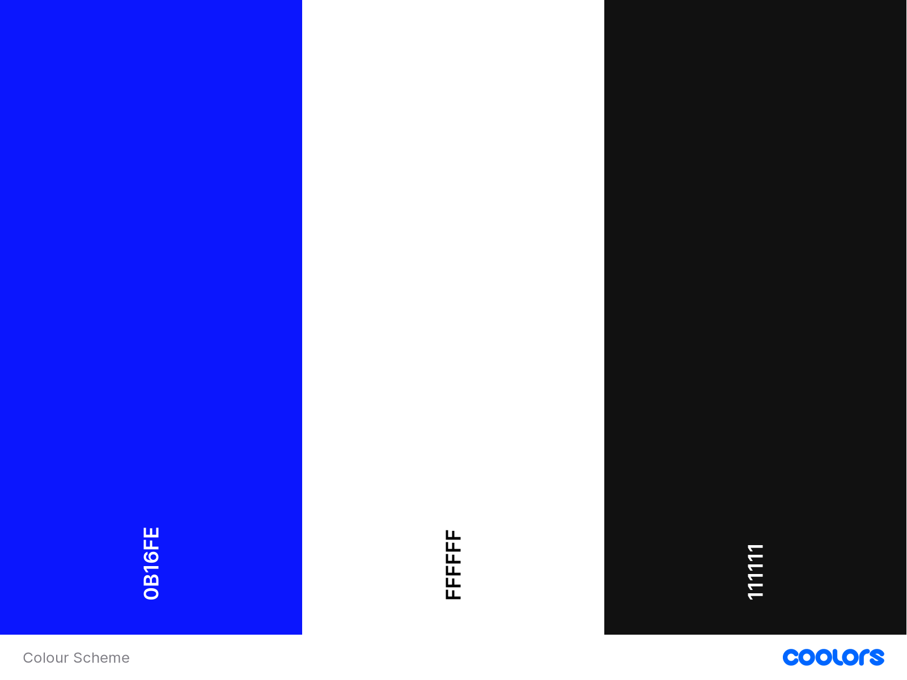
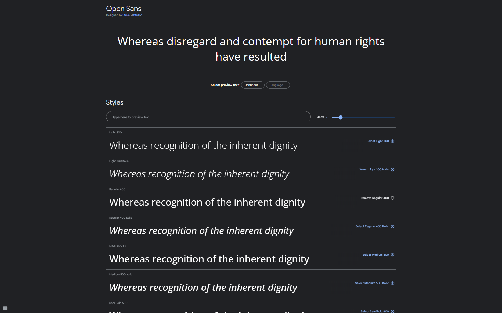

# All About History

All About History is a comprehensive platform dedicated to fostering a deeper understanding of our rich past through the exploration of significant Historical Events. This project is designed as a valuable resource for history enthusiasts, students, and curious minds alike. By delving into key events that have shaped our world, All About History provides an engaging and educational experience. Whether you're interested in ancient civilizations, pivotal battles, revolutions, cultural evolution, or the achievements of influential figures, our platform offers a curated collection of historical narratives.

## **Table of Contents**

1. [UX Development](#ux-development)

* [DESIGN](#design)
    * [Colour Scheme](#colour-scheme)
    * [Typography](#typography)
    * [Imagery](#imagery)
    * [Wireframes](#wireframes)

2. [Features](#features)  
    
    * [General Features On All Pages](#general-features-on-all-pages)
    * [Features Of Each Page](#features-of-each-page)

3. [Testing](#testing)
    * [TESTING.md](#testing)

4. [Deployment](#deployment)  
    * [Deployment Github Pages](#deployment-to-github-pages)
    * [Steps To Use This Project](#steps-to-use-this-project)  

5. [Credits](#credits)  
    * [Content](#content)
    * [Media](#media)

6. [Technology Used](#technology-used)  
    * [Language Used](#language-used)

## **UX Development**

## **Design**

### **Colour Scheme**

The selected color scheme was thoughtfully chosen to convey a distinct visual identity that aligns with the project's overall design philosophy, creating a cohesive and engaging user experience.

### **Typography**

As the main focus of the site is the messages that people are sending, I have only used one font throughout the site to prevent users becoming overwhelmed.

Open Sans was imported from google fonts. It is a sans-serif font which is accessible friendly.

### **Wireframes**

The entire site's wireframe was done using [balsamiq wireframes](https://balsamiq.com/).This depicts the site on a desktop and a mobile device.

[Home Page Wireframe](assets/images/home-page-wireframes.png)

[Learn more Wireframe](assets/images/learn-more-page-wireframes.png)

[Sign Up Wireframe](assets/images/sign-up-page-wireframes.png)

---

## Features

### **General Features On All Pages**

The site has been designed to be fully responsive, from mobile all the way up to desktop.

- __Navigation Bar__

- Featured on all three pages, the full responsive navigation bar includes links to the Logo, Home page, Learn more and Sign Up page and is identical in each page to allow for easy navigation.

 - This section will allow the user to easily navigate from page to page across all devices without having to revert back to the previous page via the back button.

- __The landing page image__

 - The landing includes a photograph with text overlay to allow the user to see exactly which location this site would be applicable to. 
  - This section introduces the user to All About History with an eye catching animation to grab their attention.

  

  - __The Info section__

  This section will allow the user to select if they want to learn more or sign up for our monthly newsletter.

  

  - __The Footer__ 

   - The footer section includes links to the relevant social media sites for All About History and a paragraph about the All About History project.

   - The links will open to a new tab to allow easy navigation for the user.

   - The footer is valuable to the user as it encourages them to keep connected via social media.

- __Learn more__

- The Learn more will provide the user with supporting images and infomation about historical events.

- This section is valuable to the user as they will be able to easily identify the types of infomation the organisation puts together. 

- __The Sign Up Page__

- This page will allow the user to get signed up to All About History's monthly newsletter.

- The user will be asked to submit their full name and email address. And to check the accept your terms and conditions box.

## Testing

Please view our [TESTING.md](TESTING.md) file for more information on the testing undertaken.

## **Technology Used**

### **Language Used**

HTML, CSS

### **Frameworks, libraries & Program Used**

* [balsamiq wireframes](https://balsamiq.com/) - To create wireframes.
* [Git](https://git-scm.com/) - For version control.
* [Github](https://github.com/)- To save and store the files for the website and for deployment.
* [Google DevTools](https://developers.google.com/web/tools) - To troubleshoot and test features, solve issues with responsiveness and styling.
* [Am I Responsive?](http://ami.responsivedesign.is/) To show the website image on a range of devices.
* [Google fonts](https://fonts.google.com/) - used to import the font used on the site.

  ## Deployment

- The site was deployed to GitHub pages. The steps to deploy are as follows: 
  - In the GitHub repository, navigate to the Settings tab .
  - From the source section drop-down menu, select the Master Branch.
  - Once the master branch has been selected, the page will be automatically refreshed with a detailed ribbon display to indicate the successful deployment. 

The live link can be found here - https://david011e.github.io/history_project/

## Credits 

### Content

- The links for the Learn more page for more infomation were from [britannica](https://www.britannica.com/).

- The text for the Home page and footer was taken from Google.

- The icons in the footer were taken from [Font Awesome](https://fontawesome.com/).

- Fonts for this project were used from [Google fonts](https://fonts.google.com/).

### Media

- The photos used on the info and sign up page are from This Open Source site [Pexels](www.pexels.com).

- The photos used on the hero and Learn More page are from This Open Source site [Unsplash](https://unsplash.com/).